<div align="center">

# SFCC Affiliate Product (AffiliateX)

### Turn customers into affiliates. Reward delivered referrals with single-use vouchers.

Permanent affiliate codes, product share links, referral attribution at checkout,
prepaid-only referred orders, and a 10% voucher issued once a referred order is delivered.

[](https://github.com/Vedesh-reddy/sfcc-affiliate-product/actions/workflows/ci.yml)


[Get started](docs/INSTALLATION.md) · [Merchant guide](docs/MERCHANT-GUIDE.md) · [Code reference](docs/CODE-REFERENCE.md) · [Architecture](docs/ARCHITECTURE.md) · [Phase PRs](docs/DEVELOPMENT-PHASES.md)

</div>

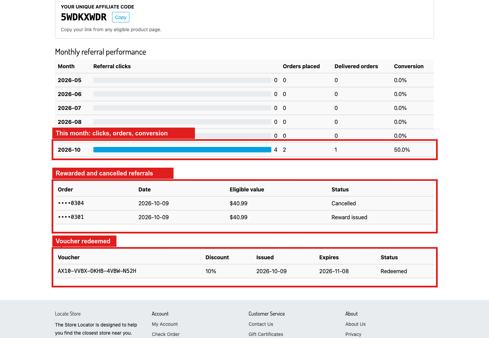

> Screenshots were captured on the author's sandbox (`zyeu-002`, site `RefArch_Practice`) on October 9, 2026.
> The orders are real SFCC orders and the voucher is a real system-generated coupon code. Red boxes mark what each feature adds.

## What it does

| For shoppers | For merchants | For developers |
| --- | --- | --- |
| Generate a permanent 8-character affiliate code | Configure everything in one **Affiliate Product** preference group | One `plugin_affiliateproduct` overlay; no base file edited |
| Copy a Share & Earn link from any eligible product | Exclude products with one attribute | Five custom object types with clear keys and retention |
| Enter or remove a referral code at checkout | Native coupon and promotion apply the discount | `module.superModule` wrappers for checkout, cart and login return |
| Earn a 10% voucher after each delivered referral | Two scheduled jobs: reward issuance and voucher upkeep | Idempotent rewards keyed `orderNo:v1` |
| See clicks, orders, deliveries and vouchers | Suspend or rotate a code in Business Manager | CSRF on every post, ownership checks on vouchers |
| Use the voucher once, on their own account | See why a reward is pending (`reviewReason`) | Categorized logging (`affiliate-product`) |

## Start in five steps

```sh
git clone https://github.com/Vedesh-reddy/sfcc-affiliate-product.git
cd sfcc-affiliate-product
npm ci
npm run validate
npm run package:metadata
```

1. **Build:** `npm run validate` runs the linters, 23 unit tests and the asset build.
2. **Deploy:** upload `cartridges/plugin_affiliateproduct`, including the generated `cartridge/static`, to your code version.
3. **Activate:** put `plugin_affiliateproduct` first on the storefront cartridge path.
4. **Import:** rename `metadata/affiliate-product/sites/RefArch` and the job `site-id` to your site, rebuild the ZIP and import `dist/affiliate-product-metadata.zip`.
5. **Configure:** add the footer link and schedule the two jobs.

```text
plugin_affiliateproduct:app_storefront_base
```

The [installation guide](docs/INSTALLATION.md) covers each step.

## Features

| # | Feature | Shopper entry point | Data | Job |
| --- | --- | --- | --- | --- |
| 1 | [Affiliate program and code](#1-affiliate-program-and-code) | Footer link, `Affiliate-Show` | `AffiliateProfile`, `AffiliateCustomerIndex` | — |
| 2 | [Share & Earn on the product page](#2-share--earn-on-the-product-page) | Product page | — | — |
| 3 | [Referral link tracking](#3-referral-link-tracking) | `?aff=CODE` product links | `AffiliateDailyStats`, cookie `affiliate-ref` | — |
| 4 | [Referral code at checkout](#4-referral-code-at-checkout) | Order summary panel | Basket and order attributes | — |
| 5 | [Prepaid-only referred orders](#5-prepaid-only-referred-orders) | Place order | — | — |
| 6 | [Reward engine](#6-reward-engine) | — | `AffiliateOrder`, `AffiliateReward` | `AffiliateProduct-ProcessRewards` |
| 7 | [Voucher security and redemption](#7-voucher-security-and-redemption) | Cart promo code | `AffiliateReward`, native coupon | — |
| 8 | [Affiliate dashboard](#8-affiliate-dashboard) | `Affiliate-Dashboard` | All of the above | — |
| 9 | [Voucher lifecycle](#9-voucher-lifecycle) | Email | `AffiliateReward` | `AffiliateProduct-MaintainRewards` |

---

### 1. Affiliate program and code

**What it does.** A footer link opens the program page. A signed-in customer generates a permanent 8-character code.

1. The **Affiliate Program** link sits in the footer (`footer-account` content asset).

   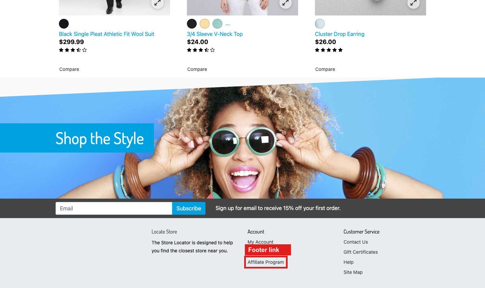

2. Anonymous shoppers see the program and a sign-in button. Login slot `rurl=4` brings them back to this page after sign-in or registration.

   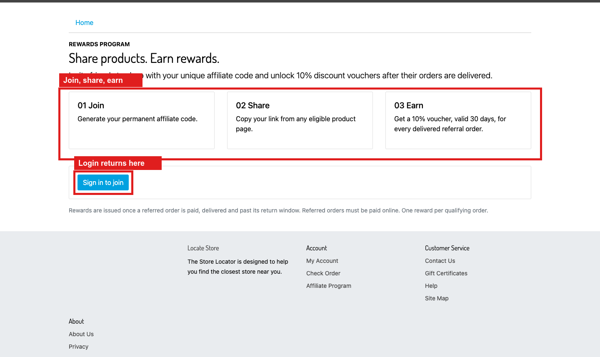

3. Signed in, the shopper generates a code.

   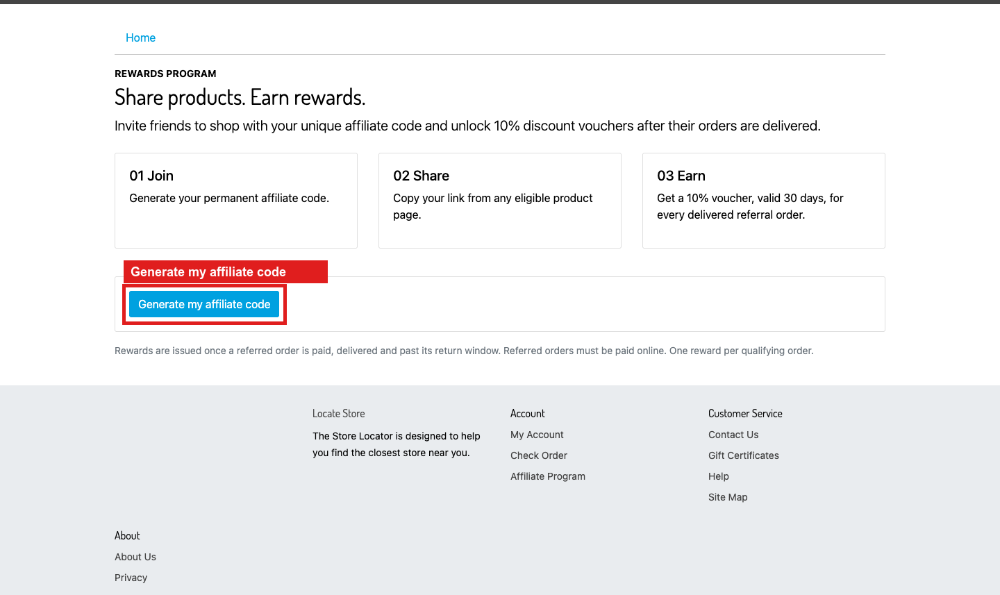

4. The code is shown with a copy button. Generating again returns the same code.

   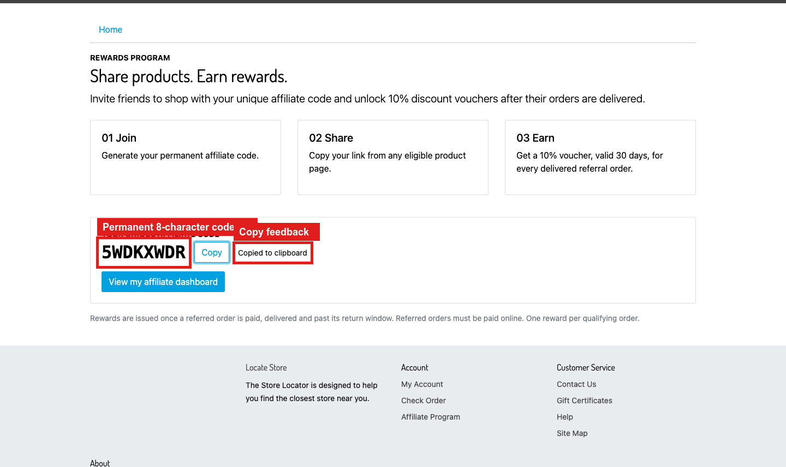

**Rules**

- Codes use `23456789ABCDEFGHJKLMNPQRSTUVWXYZ` (no 0/O/1/I), come from `SecureRandom` and do not encode the customer number.
- One identity per customer: the `AffiliateCustomerIndex` key is the customer number, so a concurrent second request fails on the unique key and returns the first profile. A colliding code is retried.
- A merchant suspends a code by setting `AffiliateProfile.status` to `SUSPENDED`, or rotates it with `ROTATED`; the customer gets a new code on the next visit.

---

### 2. Share & Earn on the product page

**What it does.** Signed-in affiliates get a copyable link for the product they are viewing.

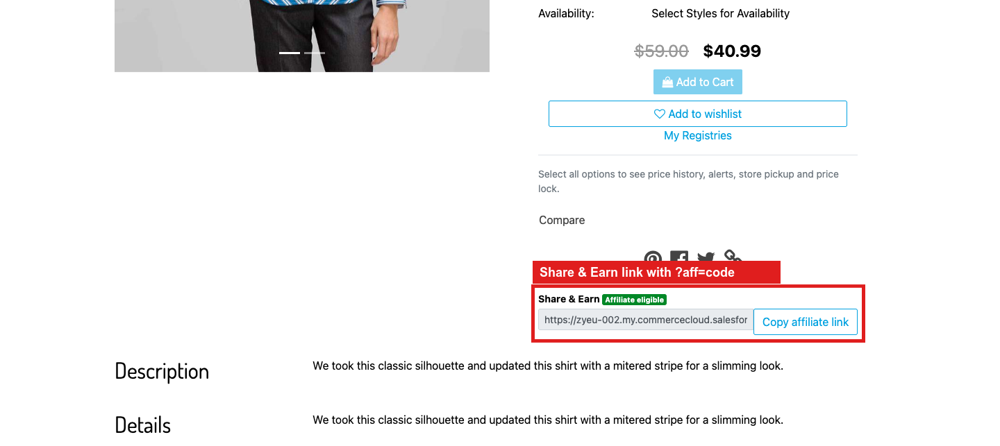

Products with `affiliateExcluded = true` show no link:

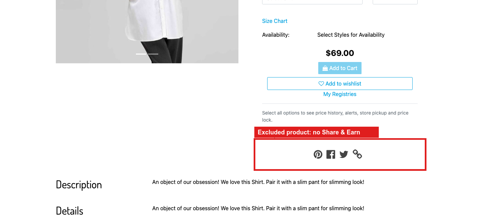

**How.** `product/components/socialIcons.isml` (SFRA copy plus one include) adds an uncached remote include, `Affiliate-Share`, so the cached product page stays cached.

---

### 3. Referral link tracking

**What it does.** Opening a `?aff=CODE` link validates the code, counts one click per session, stores a first-party cookie for the attribution window and shows a notice.

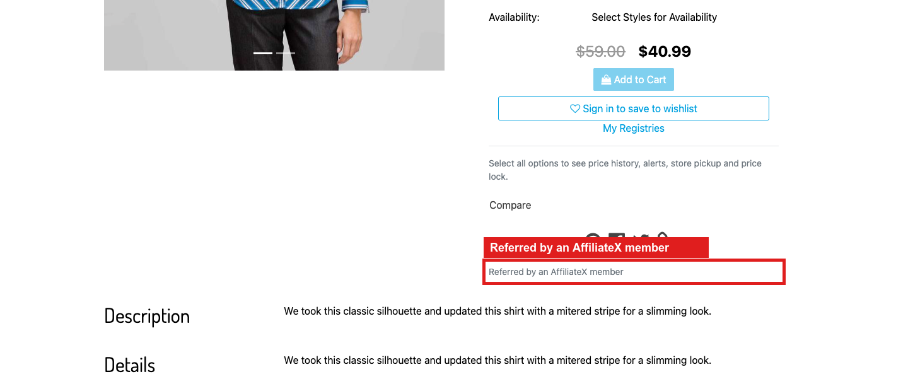

The referral then appears in checkout, marked as coming from the link:

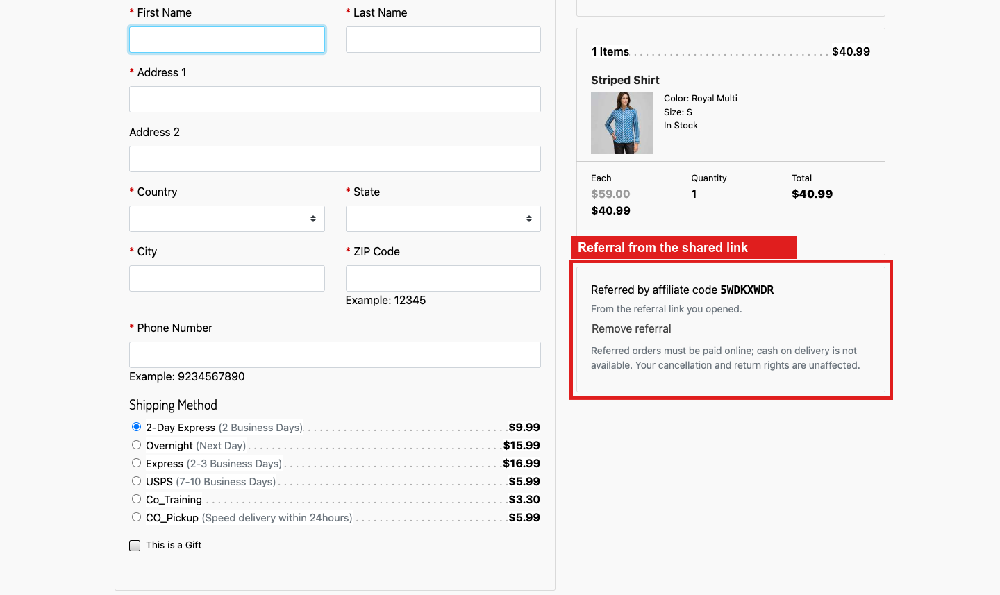

**Rules**

- Cookie `affiliate-ref` is HttpOnly and Secure and lasts `AffiliateAttributionWindowDays` (30). It holds only the public code and the click time.
- Refreshes do not add clicks. The affiliate's own visits are not counted.
- The newest referral link wins.

---

### 4. Referral code at checkout

**What it does.** A "Referred by someone?" panel under the order summary lets the shopper remove the referral or enter a code. The code identifies the referrer; it never discounts the shopper's order.

1. Removing the referral ignores the link for this basket.

   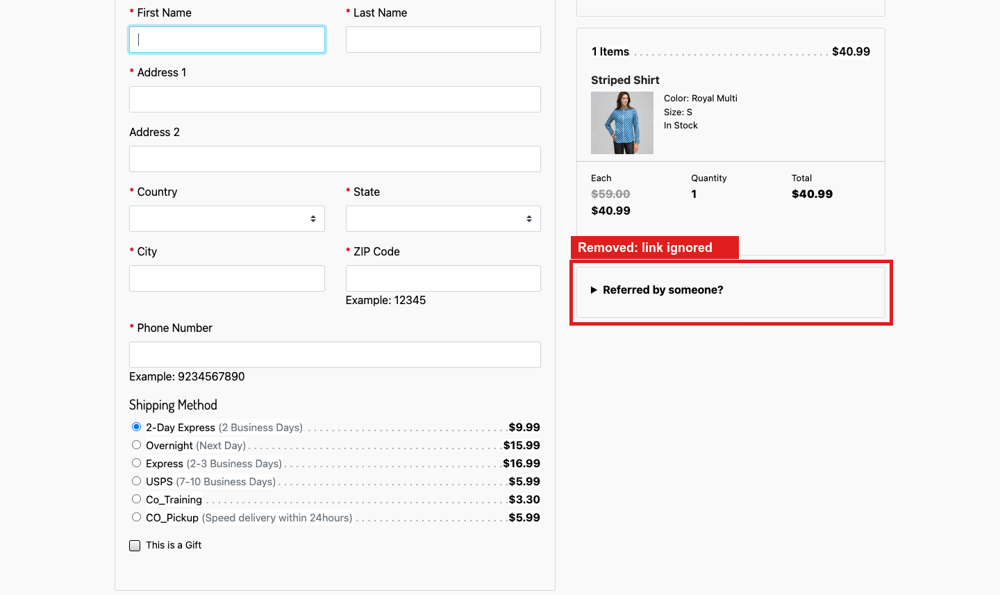

2. Unknown codes are rejected.

   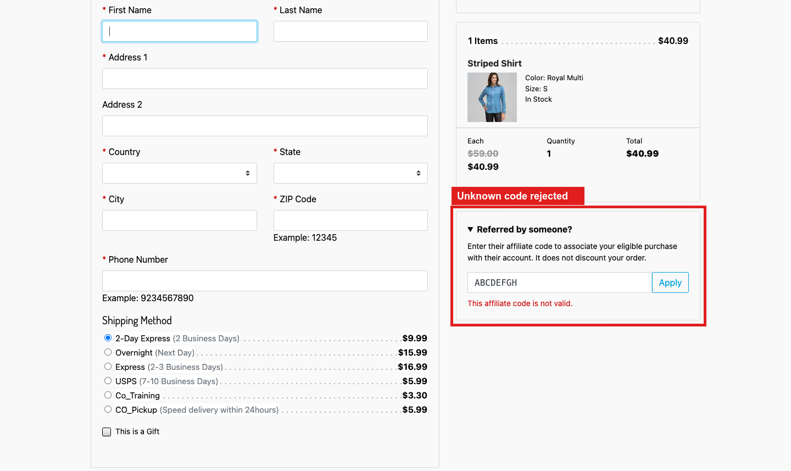

3. A valid code is confirmed. It wins over any referral link.

   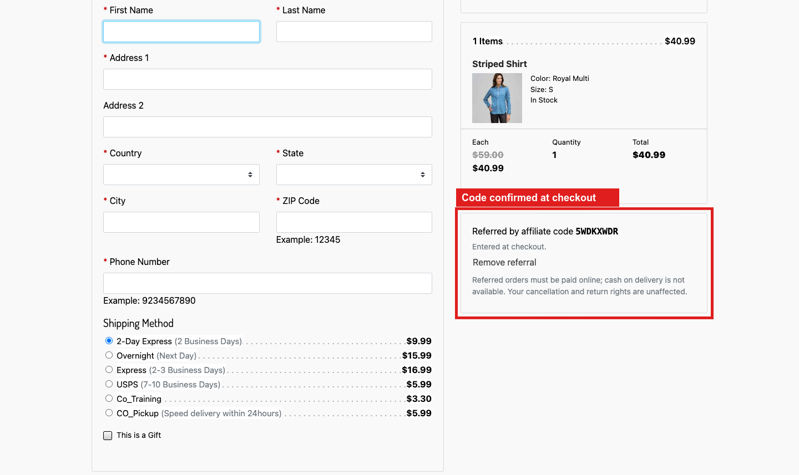

4. The referral is shown until the order is placed.

   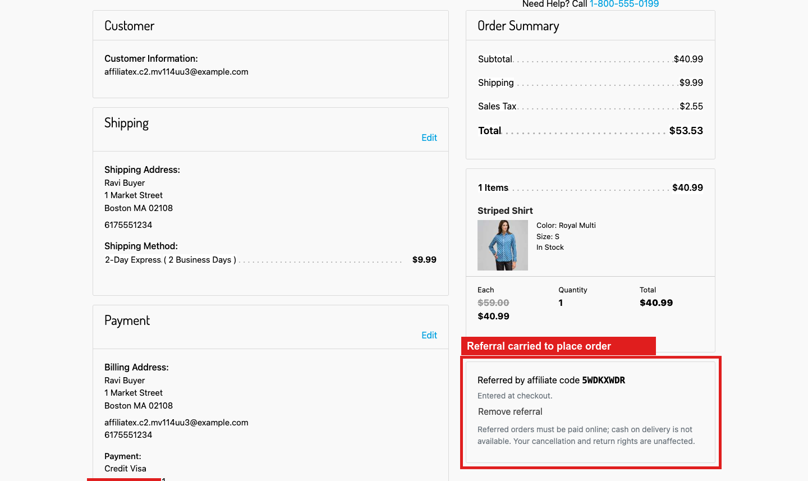

   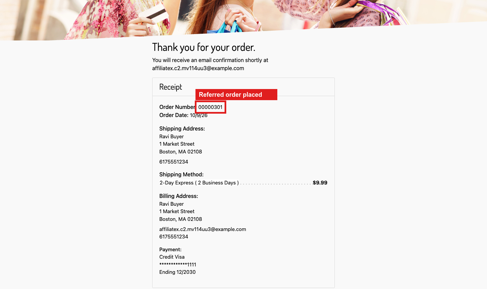

5. A shopper cannot use their own code, by account or by email.

   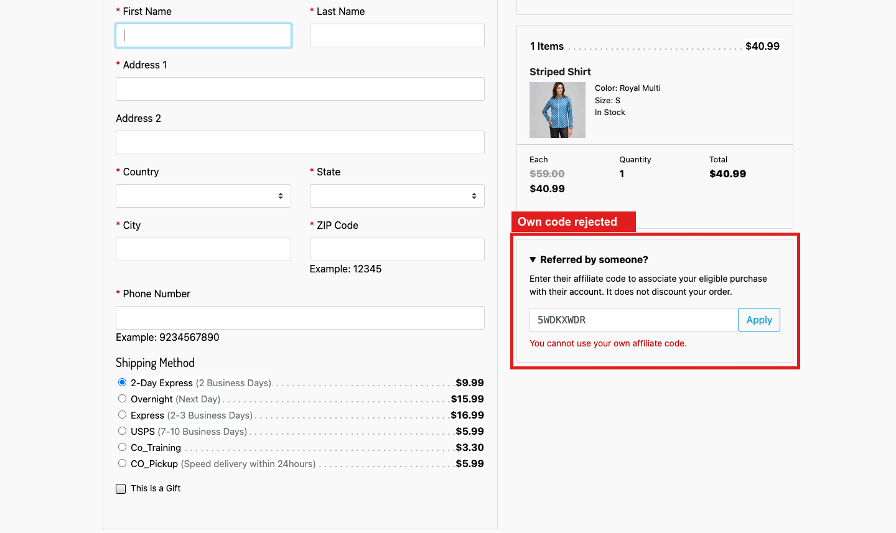

6. Attempts are limited to 10 per session.

   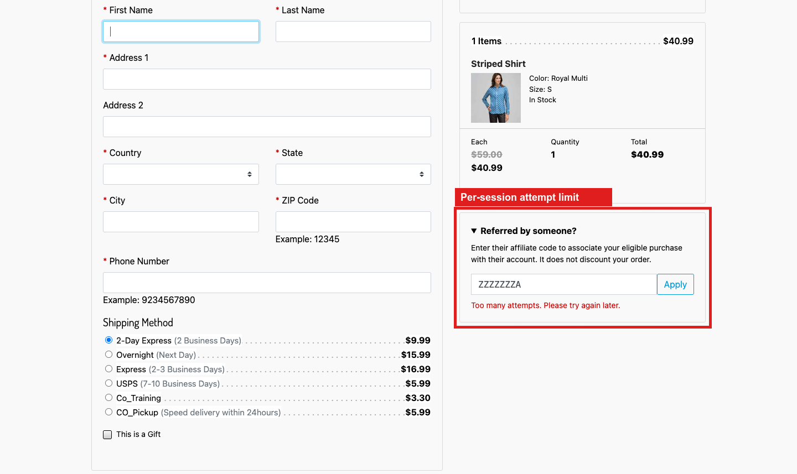

**How.** `checkout/orderProductSummary.isml` (SFRA copy plus one include) renders the panel only when `Checkout-Begin` sets `affiliateCheckout`. `CheckoutServices-PlaceOrder` (prepend) settles the attribution on the basket; the `checkoutHelpers` wrapper copies it to the order and records an `AffiliateOrder` snapshot. Lines whose product has `affiliateExcluded` do not count.

---

### 5. Prepaid-only referred orders

**What it does.** Referred orders may only use the payment methods in `AffiliatePrepaidPaymentMethods` (empty = `CREDIT_CARD`). The panel discloses this before payment. Otherwise place order is refused, and the shopper can remove the referral to pay another way.

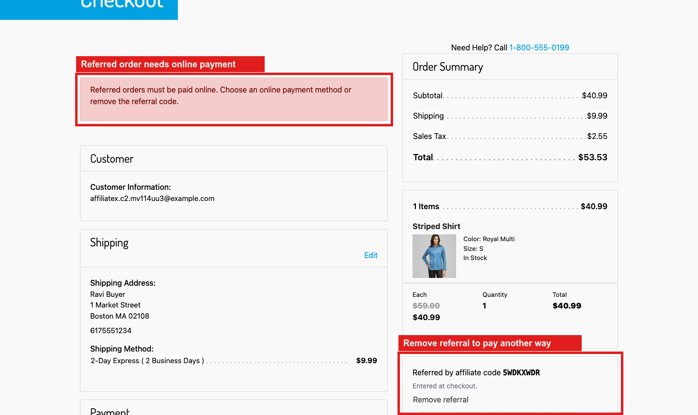

Captured with the preference temporarily set to `COD`, so the card counted as not prepaid. Cancellation and return rights are not changed by a referral.

---

### 6. Reward engine

**What it does.** `AffiliateProduct-ProcessRewards` (every 30 minutes) moves each pending referral order forward:

| Order state | Result |
| --- | --- |
| Cancelled or failed | `CANCELLED`, no reward |
| Has a return case | `INELIGIBLE` |
| Not paid | waits (`reviewReason = NOT_PAID`) |
| Not shipped (order, or every shipment) | waits (`NOT_DELIVERED`) |
| First seen shipped | records `deliveredAt` |
| Within `AffiliateRewardDelayDays` of delivery | waits (`RETURN_WINDOW`) |
| Eligible value below `AffiliateMinimumOrderValue` | `INELIGIBLE` |
| Affiliate suspended | waits |
| Otherwise | issues one voucher, emails it |

After the referred order (`••••0301`) is placed, the dashboard counts the click and the order:

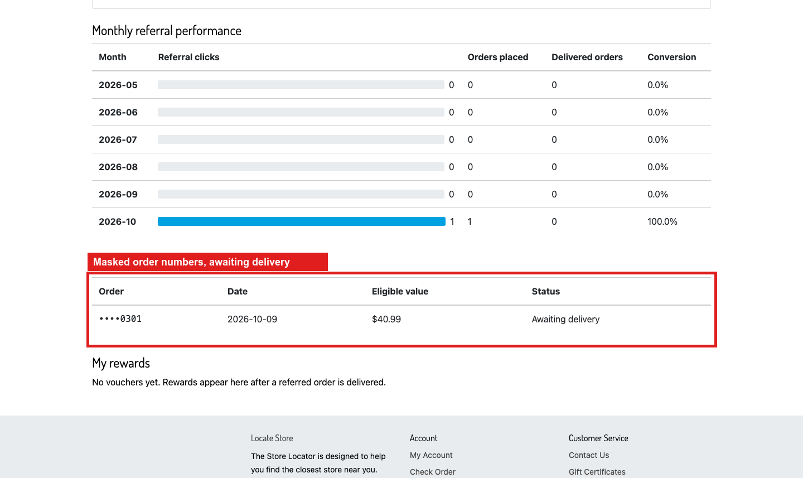

Order 00000301 was then set to Paid with its shipment Shipped, and order 00000304 was cancelled. Two job runs recorded delivery and issued the voucher:

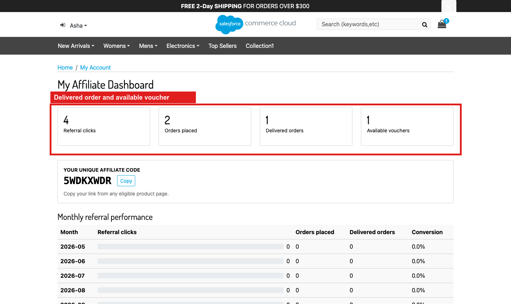

**Rules**

- One reward per qualifying order. The reward key is `orderNo:v1`, so retries and parallel runs never issue twice.
- The voucher code comes from the native system-codes coupon `affiliate-reward` (`Coupon.getNextCouponCode()`), in the same transaction as the reward record.
- If no code is left, the order stays pending and the job reports `ERROR`.
- The reward email goes to the affiliate's account email after the transaction; the maintenance job retries it if it failed.

---

### 7. Voucher security and redemption

**What it does.** The 10% discount is a normal promotion (`affiliate-reward-10`) on the coupon. The cartridge adds ownership and lifecycle checks in `Cart-AddCoupon` and again at place order.

1. Another account cannot use the voucher.

   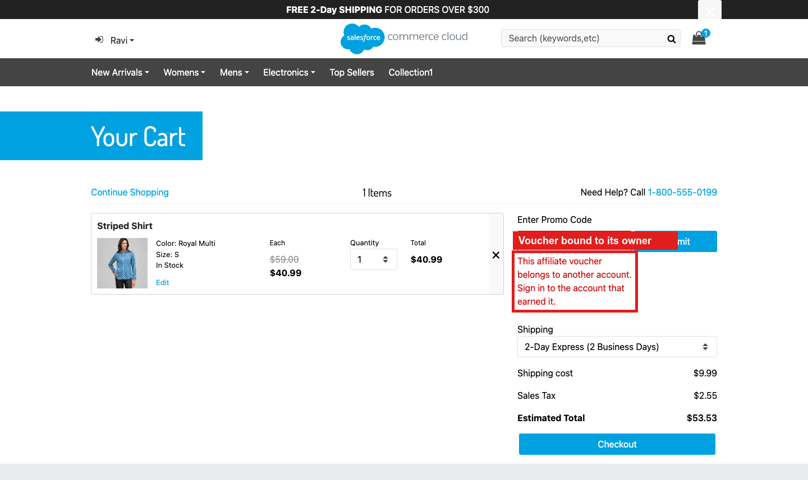

2. The owner gets 10% off.

   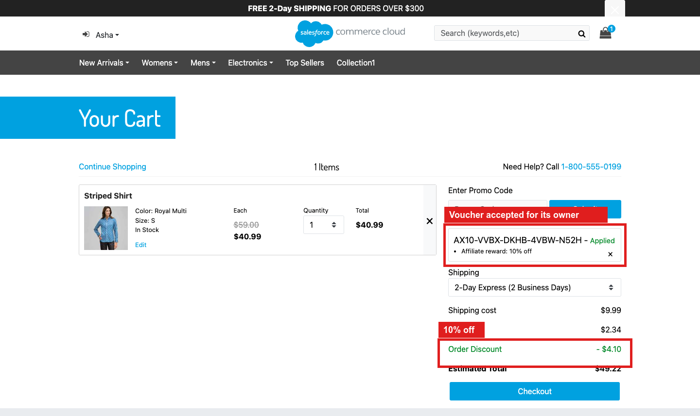

3. After the order, the voucher is single use.

   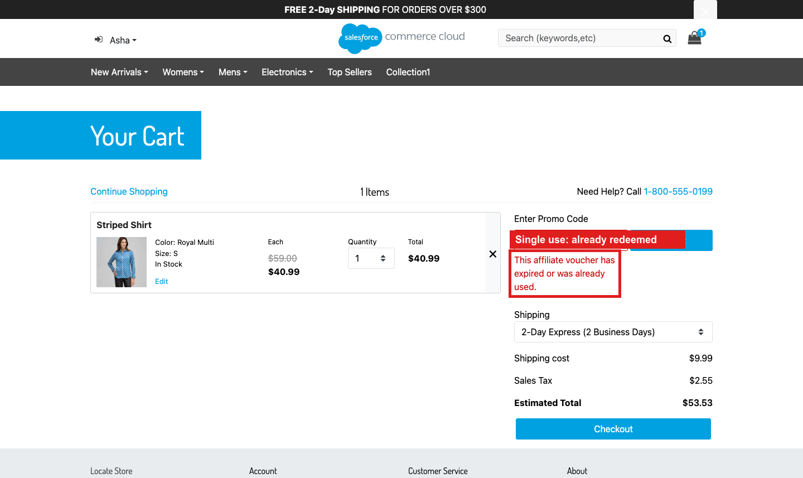

**Rules.** The voucher is valid only for its owner, while `ISSUED` and before `expiresAt` (30 days). Only one affiliate voucher is allowed per order. Single use is the coupon's native limit of 1 per code; placing the order marks the reward `REDEEMED`.

---

### 8. Affiliate dashboard

**What it does.** `Affiliate-Dashboard` shows totals, the code, six months of clicks, orders, deliveries and conversion, referral orders and the voucher wallet.


Before any referral:

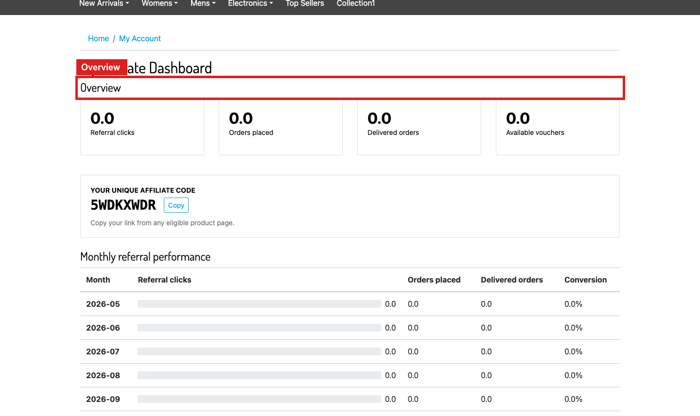

**Privacy.** The affiliate sees only the last four digits of a referred order number and its eligible value, never the buyer's name, email or address.

---

### 9. Voucher lifecycle

`AffiliateProduct-MaintainRewards` (daily) handles issued vouchers:

- revokes them when the source order was cancelled or has a return case;
- expires them after `expiresAt`;
- retries a failed reward email;
- sends one reminder `AffiliateExpiryReminderDays` (5) before expiry.

A voucher that was already redeemed is not clawed back when its source order is returned later. This path is covered by unit tests, not screenshots.

---

## Documentation

| Guide | Contents |
| --- | --- |
| [Installation](docs/INSTALLATION.md) | Deploy, cartridge path, metadata, coupon and promotion, footer link, jobs |
| [Merchant guide](docs/MERCHANT-GUIDE.md) | Preferences, jobs, custom objects, suspending and rotating codes |
| [Architecture](docs/ARCHITECTURE.md) | Request flows, extension points, data model, security and concurrency |
| [Code reference](docs/CODE-REFERENCE.md) | Every controller route, script module and job step |
| [Testing](docs/TESTING.md) | Automated checks and the sandbox checks behind the screenshots |
| [Troubleshooting](docs/TROUBLESHOOTING.md) | Symptoms, causes and fixes found on a real sandbox |
| [Development phases](docs/DEVELOPMENT-PHASES.md) | The five review PRs |

See [NOTICE.md](NOTICE.md) for attribution and terms.
